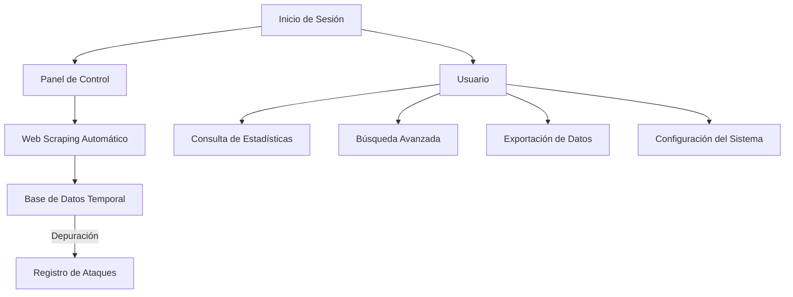

deimer

"Introducción"

El proyecto está diseñado para registrar, unificar y analizar información sobre ataques cibernéticos en países latinoamericanos y España. Este sistema busca proporcionar estadísticas detalladas, visualizaciones y herramientas de búsqueda avanzadas, orientadas principalmente a investigadores y estudiantes de ciberseguridad.

---

"Tecnologías Utilizadas"
- Backend: Laravel (PHP).
- Base de datos: MySQL.
- Frontend: Vue.js.
- Web scraping: JavaScript.

---

"Público Objetivo"
- Profesionales de ciberseguridad: Investigadores, blue teams, y pentesters.
- Estudiantes: Interesados en entender y analizar ataques cibernéticos en la región hispanoamericana.

---

"Requerimientos Funcionales"
1. Estadísticas segmentadas por país, fecha y tipo de ataque.
2. Sección de noticias relacionadas con ciberseguridad.
3. Apartado para código fuente de software malicioso (enlace a repositorio GitHub).
4. Información sobre actualizaciones y soluciones del software malicioso.
5. Detalles técnicos: CVE y CVSS.
6. Buscador avanzado.
7. Información adicional con enlaces externos.
8. Herramienta para generar estadísticas personalizadas.
9. Tabla de registro con las siguientes columnas:
   - Fecha del incidente.
   - Fecha de anuncio.
   - Tipo de ataque.
   - Método de ataque.
   - Autor.
   - Víctima.
   - Región.
   - Sector afectado.
   - Data leak (si hubo).
   - Confirmado por la víctima.
   - Fuente del reporte.
   - Estado del incidente.
   - Archivo involucrado.
   - En venta.
   - Severidad (CVSS).
   - Enlace a detalles.

---

"Flujo del Sistema y Módulos Principales"
Flujo General del Sistema

Inicio de Sesión y Autenticación
El administrador inicia sesión en el sistema mediante credenciales verificadas.
Autenticación mediante un middleware que verifica los permisos del usuario.

Panel de Control
El administrador accede al panel principal donde se resumen las estadísticas generales de ataques cibernéticos.
Acceso a las diferentes funcionalidades del sistema mediante un menú de navegación lateral.

Registro de Ataques
Permite al administrador ingresar manualmente los detalles de nuevos ataques cibernéticos.
Validación de datos antes de almacenar la información en la base de datos.

Consulta de Estadísticas
Usuarios pueden filtrar información basada en países, fechas, tipos de ataque, entre otros.
Visualización mediante gráficos interactivos.
Búsqueda Avanzada
Herramienta para buscar ataques específicos utilizando filtros como nombre, fecha, tipo de ataque, etc.

Web Scraping Automático
Un sistema automatizado realiza scraping de páginas seleccionadas para recolectar nuevos casos de ataques cada dos días.
Almacena los datos en una base de datos temporal para revisión y depuración manual.

Exportación de Datos
Los usuarios pueden generar reportes en formatos PDF o CSV de las estadísticas o información específica.

Configuración del Sistema
Módulo para que el administrador ajuste parámetros como sitios web para web scraping, filtros predeterminados, etc.

Módulos Principales
1. Autenticación y Gestión de Usuarios
Funcionalidades:
    -Inicio de sesión seguro con Laravel Authentication.
    -Control de acceso basado en roles.

2. Registro de Ataques
Datos requeridos:
    -País
    -Fecha del ataque
    -Tipo de ataque
    -Autor (si se conoce)
    -Víctimas
    -Data Leak (si ocurrió)
    -Estado del software (en venta o no)
    -Archivo involucrado
    -Validación de datos y confirmación del registro.

3. Estadísticas y Visualización
Funcionalidades:
Gráficos avanzados como:
    -Barras apiladas (ataques por país y tipo).
    -Líneas (evolución de ataques por fecha).
    -Comparación entre países o regiones.
    -Personalización de estadísticas según filtros específicos.

4. Búsqueda y Filtrado
Herramienta de búsqueda avanzada para encontrar ataques específicos.
Posibilidad de combinar múltiples filtros (país, tipo de ataque, fecha, etc.).

5. Web Scraping
Funcionalidades:
    -Programación automática cada 2 días.
    -Páginas seleccionadas para recolección de datos sobre ataques.
    -Almacenamiento en base de datos temporal para revisión.

6. Sección de Noticias
Muestra las noticias relevantes sobre ciberseguridad en Latinoamérica y España.
Fuentes enlazadas para mayor detalle.

7. Exportación de Información
Permite a los usuarios descargar datos o reportes personalizados en formatos PDF o CSV.

8. Configuración del Sistema
Opciones para:
    -Ajustar parámetros de scraping.
    -Gestionar filtros predeterminados.
    -Modificar configuraciones generales.

Casos de Uso

Caso de Uso 1: Registrar un ataque cibernético
Actor Principal:Administrador del sistema

Precondiciones:
- El administrador está autenticado.
- El sistema tiene conexión con la base de datos.

Flujo principal:
1. El administrador accede al módulo de registro de ataques.
2. Introduce los datos requeridos:
   - País
   - Fecha del ataque
   - Tipo de ataque
   - Autor (si existe)
   - Víctimas
   - Reporte y enlaces adicionales.
3. El sistema valida la información.
4. Se guarda la información y se confirma el registro.

Flujos alternativos:
- Fallo en validación: El sistema solicita correcciones si los datos están incompletos o no cumplen con las reglas.

---

Caso de Uso 2: Consultar estadísticas por país
Actor Principal:Usuario (investigador o estudiante)

Precondiciones:
- El usuario está autenticado (si es necesario).
- Existen registros en la base de datos.

Flujo principal:
1. El usuario selecciona un país.
2. El sistema muestra:
   - Número total de ataques por tipo.
   - Comparativa con otros países.
   - Gráficos históricos o por fechas.

Flujos alternativos:
- Sin registros: Se muestra el mensaje: "No se encontraron datos para este país."

---

Caso de Uso 3: Buscar un ataque específico
Actor Principal:Usuario (investigador o estudiante)

Precondiciones:
- Existen registros en la base de datos.

Flujo principal:
1. El usuario ingresa criterios de búsqueda como:
   - Nombre del ataque
   - Fecha
   - Tipo de ataque.
2. El sistema filtra y muestra resultados.

Flujos alternativos:
- Sin coincidencias: El sistema muestra el mensaje: "No se encontraron resultados."

---

 Caso de Uso 4: Consultar el código fuente del software malicioso
Actor Principal:Usuario (investigador o estudiante)

Precondiciones:
- El software malicioso tiene un enlace de referencia.

Flujo principal:
1. El usuario accede al detalle de un ataque.
2. Selecciona "Ver código fuente".
3. El sistema redirige al repositorio correspondiente.

---

Caso de Uso 5: Crear estadísticas personalizadas
Actor Principal:Usuario (investigador)

Precondiciones:
- El usuario tiene acceso a la herramienta de estadísticas.
- Existen registros en la base de datos.

 Flujo principal:
1. El usuario accede al módulo de estadísticas personalizadas.
2. Selecciona filtros como:
   - Países
   - Fechas
   - Tipos de ataque.
3. El sistema genera gráficos y tablas.
4. El usuario puede guardar o descargar los resultados.

---

Caso de Uso 6: Realizar web scraping para recolectar casos de ataques cibernéticos
Actor Principal: Sistema automatizado

Precondiciones:
- Se han definido páginas de referencia para el scraping.
- El sistema tiene permisos y capacidad técnica.
- Existe un módulo de almacenamiento temporal.

Flujo principal:
1. El sistema ejecuta el scraping automáticamente cada 2 días.
2. Recolecta datos como:
   - País afectado
   - Fecha del ataque
   - Tipo de ataque
   - Fuente.
3. Almacena los datos temporalmente.
4. Genera un informe inicial.

 Flujos alternativos:
- Página inaccesible Registra un error y reintenta en el siguiente ciclo.
- Datos incompletos:Marca los datos para revisión manual.

